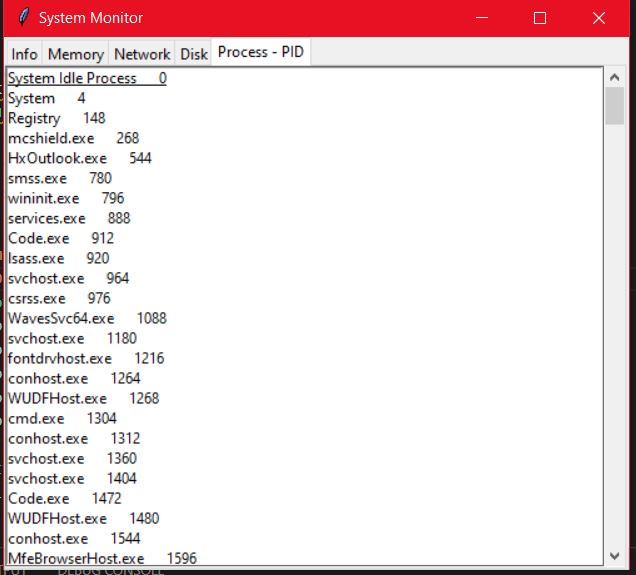

# System-Resource-Monitor
h2 {OS Project -}  
This Project is done using Python where we used libraries like tkinter for GUI, psutil library for getting memory,disk, network details
and all currently running processes along with their id's, os and platform libraries for getting basic user information. And Modules like
FigureCanvasTkAgg and Figure from matplotlib for the sake of visualization in memory and disk tab. 
Here are Some Sample Screenshots of the GUI created for the project. 
 
 
 
 
 
